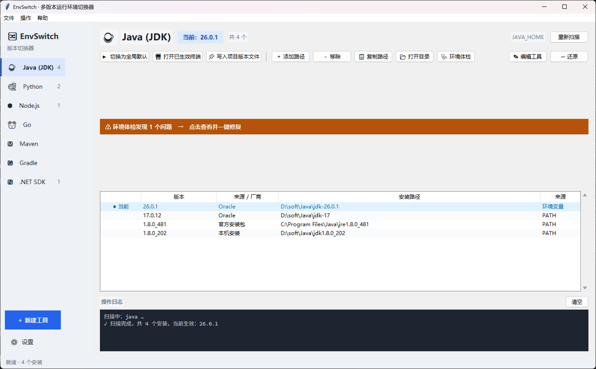

<div align="center">

# 🔀 EnvSwitch

**多版本运行环境一键切换器 —— Java / Python / Node / Go / Maven / Gradle / .NET，以及任何你想自定义的工具**

*像 nvm 一样切换，但更直观：全图形界面，点一下就切，还能一键还原。*

[](LICENSE)
[](https://www.python.org/)
[]()
[]()

</div>

---

## 为什么需要它

每个开发者都被这些事情折磨过：

- 电脑上同时装着 **JDK 8 / 17 / 26**，改 `JAVA_HOME` 全靠手打路径
- **Python 3.10 / 3.12 / 3.14** 并存，`pip` 装的命令行工具总是跑错版本
- nvm/pyenv 很好，但要记命令，且只管一种语言
- 用系统设置面板改环境变量：要点十几次，改完还得重开终端

**EnvSwitch 把这件事变成：打开软件 → 选中版本 → 点一下。**

## 特性

- 🖱️ **一键切换全局默认**：自动写入 `JAVA_HOME` 等环境变量，并把选中版本的目录**排到 `PATH` 最前**——只调顺序、不删条目，所以永远不会"切着切着版本就少了"
- 🧠 **安装记忆**：见过的版本会记进配置，哪怕某天从 `PATH` 里掉出去也能找回来；还会顺带"学会"安装根目录，把同目录下的兄弟版本一起翻出来
- 🔍 **自动扫描**：识别 JDK、Python、Node、Go、Maven、Gradle、.NET 的常见安装位置，包括 nvm、pyenv、conda、SDKMAN、Scoop、Homebrew 装的
- 🧩 **任意工具自定义**：Ruby、PHP、Flutter、adb…… 通过图形界面定义一套「识别规则 + 版本命令 + 环境变量」，就能纳入管理
- 🖥️ **打开已生效终端**：切换后立刻拉起一个新终端，环境已经就位，不用碰运气重开
- 📌 **项目级版本文件**：一键生成 `.java-version` / `.python-version` / `.nvmrc`
- ↩️ **完整可撤销**：所有写入都留有记录，「还原」按钮一键清理，绝不污染你的配置
- 🩺 **环境体检**：自动找出"装了但没进 PATH"的安装、失效/重复的 PATH 条目、以及会让切换失效的冲突，逐条给出一键修复
- 🛡️ **系统 PATH 冲突修复**：Windows 上系统 PATH 优先级高于用户 PATH，本工具能检测并在取得授权后清理冲突条目（自动备份，可还原）
- 🍃 **零依赖**：纯 Python 标准库 + tkinter，无任何第三方包
- 🖥️ **三平台**：Windows（用户级注册表，无需管理员）/ macOS / Linux（shell 配置标记块，bash/zsh/fish）
- ⌨️ **CLI 也有**：`envswitch list java`、`envswitch use java 0`

## 界面

> 左侧是工具列表，右侧是该工具的所有安装：带 `●` 的是**命令行真正生效**的版本，
> 带 `○` 的是主目录变量指向、却被 `PATH` 里更靠前的条目挡住的版本，双击即切换。

<!-- 截图：在 Windows 上解锁屏幕后执行
       python tools/make_screenshot.py --tool java
     会生成 docs/screenshot.png，然后把下面这行取消注释即可。

-->

## 快速开始

### 方式一：源码运行（推荐先这样体验）

```bash
git clone https://github.com/<你的用户名>/EnvSwitch.git
cd EnvSwitch
python main.py          # Windows / macOS / Linux 通用
```

> Linux 需要 `sudo apt install python3-tk`（Debian 系）或 `sudo dnf install python3-tkinter`（Fedora 系）。

### 方式二：下载打包好的可执行文件

到 [Releases](../../releases) 下载对应平台的压缩包，解压即用，无需安装 Python。

也可以自己打包，见 **[docs/打包教程.md](docs/打包教程.md)**。

## 使用说明

| 操作 | 说明 |
| --- | --- |
| **切换为全局默认** | 写入 `JAVA_HOME` 等变量，并把选中版本的目录**排到用户 `PATH` 最前**；其它版本一条都不删，随时切得回来。已打开的终端/IDE 需重开 |
| **打开已生效终端** | 立即启动一个已带新环境的终端窗口，用于马上验证 |
| **＋ 添加路径** | 自动扫描漏掉的位置手动补上（比如绿色解压版 JDK） |
| **写入项目版本文件** | 在项目根目录生成 `.java-version` 等，供 jenv/pyenv 识别 |
| **↩ 还原** | 清除本工具对该工具写入的全部环境变量改动 |
| **🩺 环境体检** | 检测「装了但没进 PATH」「失效/重复条目」「系统 PATH 冲突」「PATH 里未纳管的路径」，逐条一键修复 |

### 环境体检会查什么

| 类型 | 说明 | 修复方式 |
| --- | --- | --- |
| 未加入环境变量 | 磁盘上有这个版本，但 PATH / 主目录变量里没有它，命令行用不到 | 设为当前版本（写入变量并前置 PATH） |
| 未纳入管理 | PATH 里有一段能找到该工具、但不在 EnvSwitch 列表中的路径 | 一键纳入管理，之后可切换 |
| 系统 PATH 冲突 | Windows 系统 PATH 抢在用户 PATH 前，会盖住切换结果 | 申请管理员权限清理（先备份系统 PATH） |
| 被更靠前的条目挡住 | 目标版本的 PATH 条目前面有同类旧条目 | 同上 |
| 失效条目 / 重复条目 | 指向已删除目录的残留、重复出现的 PATH 项 | 安全清理 |

对不想处理的问题（比如 Chocolatey/Scoop 的 shim 目录、历史遗留条目）可点「忽略选中」
永久隐藏，随时勾选「显示已忽略」恢复。选中问题时，对话框底部的详情面板会解释该问题的
成因、完整涉及路径与修复方式。

主界面顶部会在检测到问题时挂一条黄色提示条，点一下就能打开体检。

> 涉及系统 PATH 的修复需要管理员权限（会弹 UAC）。动手前原始系统 PATH 会自动备份到
> `~/.envswitch/system_path_backup.json`，随时可用 `envswitch systempath-restore` 或体检界面还原。
> 形如 `%JAVA_HOME%\bin` 这种"引用变量"的条目不会被清理——它会跟着你的切换一起变，属于理想状态。

### 命令行

```bash
python -m envswitch list                # 列出所有工具及其安装
python -m envswitch list java           # 只看 Java
python -m envswitch use java 0          # 按序号切换
python -m envswitch use python C:\Python312\python.exe   # 按路径切换
python -m envswitch audit           # 环境体检（没进 PATH / 失效 / 冲突 / 未纳管）
python -m envswitch audit --fix         # 体检并自动修复全部
python -m envswitch audit --ignore 2    # 忽略第 2 条（之后不再提示）
python -m envswitch audit --ignored     # 查看已忽略的问题
python -m envswitch audit --unignore all  # 恢复显示全部被忽略的问题
python -m envswitch systemfix java  # 清理 Java 的系统级 PATH 冲突（Windows，需管理员）
python -m envswitch systempath-restore   # 还原清理前的系统级 PATH
python -m envswitch restore java    # 还原某个工具
python -m envswitch restore         # 还原全部
python -m envswitch doctor          # 诊断信息
```

## 自定义任意工具

### 方式 A：图形界面

侧边栏 **＋ 新建工具**，两种模式二选一：

- **目录模式**：找到"包含某个文件"的目录（如 JDK 的 `bin/java`、Go 的 `bin/go`）
- **文件模式**：找到"文件名匹配正则"的可执行文件（如 `python3.12.exe`）

顶部可以套用内置预设（类 Java / 类 Python / 类 Node / 类 Go），填好后点 **测试识别** 验证。

### 方式 B：JSON 文件（方便分享给别人）

新建 `ruby.json`：

```json
{
  "id": "ruby",
  "name": "Ruby",
  "icon": "◆",
  "entry": "dir",
  "home_var": "RUBY_HOME",
  "detect": "bin/ruby{ext}",
  "bin_names": ["ruby"],
  "version_cmd": ["{bin}", "--version"],
  "version_regex": "ruby (\\d+\\.\\d+\\.\\d+)",
  "path_entries": ["{home}/bin"],
  "conflict_keywords": ["ruby"],
  "search_roots": {
    "windows": ["C:\\Ruby*", "~\\scoop\\apps\\ruby"],
    "macos": ["~/.rbenv/versions", "/opt/homebrew/opt"],
    "linux": ["~/.rbenv/versions", "/usr/lib/ruby"]
  }
}
```

```bash
python -m envswitch addtool ruby.json
```

**字段速查**

| 字段 | 说明 |
| --- | --- |
| `entry` | `dir` 目录模式 / `file` 文件模式 |
| `detect` | 目录模式：相对安装目录的判定文件，`{ext}` 会替换为 `.exe`（仅 Windows） |
| `file_pattern` | 文件模式：主程序文件名正则 |
| `bin_names` | 命令行名，用于 PATH 反查与"当前生效"判定 |
| `version_cmd` | 版本命令，`{bin}`=主程序路径，`{home}`=安装目录 |
| `version_regex` | 从命令输出提取版本号（取第 1 个分组） |
| `path_entries` | 需要前置到 PATH 的目录，支持 `{home}` `{bin}` |
| `conflict_keywords` | 切换时从用户 PATH 里清理掉的旧条目关键词 |
| `search_roots` | 各平台扫描根目录，支持 `~`、环境变量、`*` 通配符 |

配置统一存放在 `~/.envswitch/config.json`，可在「设置」里导入导出。

## 工作原理

```
扫描：search_roots + PATH 反查 + 环境变量 + 手动添加 + 安装记忆（见过的版本永不丢）
      → 并发探测版本（java -version / python --version / ...）
      → 高亮当前生效版本（比对 which/where 的解析结果）

切换（Windows）：写 HKCU\Environment（用户级，免管理员）
      + 把选中版本的目录排到用户 PATH 最前（只调顺序，其余条目原样保留）
      + 广播 WM_SETTINGCHANGE，新窗口立即感知
      + 检测系统级 PATH 冲突并提示

切换（macOS/Linux）：向 ~/.zshrc / ~/.bashrc / config.fish 写入标记块
      # >>> EnvSwitch:java >>>
      export JAVA_HOME="..."
      export PATH="...:$PATH"
      # <<< EnvSwitch:java <<<
      还原时按标记整块删除，你的其它配置一行都不会动
```

## 常见问题

<details>
<summary><b>切换后终端里版本没变？</b></summary>

已打开的终端继承的是启动时的环境，必须**重开**（或用「打开已生效终端」）。
IDE 要彻底关闭再开（有些 IDE 常驻托盘）。
</details>

<details>
<summary><b>Windows 提示「系统级 PATH 存在冲突」？</b></summary>

Windows 的生效顺序是「系统 PATH → 用户 PATH」，如果 `C:\Program Files\Java\xxx\bin` 在系统 PATH 里，用户级的切换压不过它。

EnvSwitch 会在「环境体检」里把这类条目标红，点「修复」后申请管理员权限清理（自动先备份）；不想动系统 PATH 的话，用「打开已生效终端」也能绕过它。
形如 `%JAVA_HOME%\bin` 的条目不会被视为冲突——它会跟着你切换的 `JAVA_HOME` 一起变。
</details>

<details>
<summary><b>杀毒软件报毒？</b></summary>

PyInstaller 单文件版的通病。用 `python build_exe.py --onedir` 打目录版误报率低很多，或者自行用 `pyinstaller --key` / 代码签名证书签名。
</details>

<details>
<summary><b>和 nvm / pyenv / sdkman 冲突吗？</b></summary>

不冲突。EnvSwitch 修改的是环境变量层，nvm 等工具管的是自己的安装目录；nvm 装的版本一样会被扫描进来。
</details>

## Roadmap

- [ ] 系统托盘常驻 + 全局快捷键
- [ ] macOS `.app` 包与代码签名
- [ ] 深色模式完善（已有基础配色）
- [ ] 按项目目录自动切换（监听 `cd`）
- [ ] 多语言（i18n）

## 贡献

欢迎 PR！尤其欢迎：补充内置工具定义（`envswitch/core/builtins.py`）、补充各平台扫描路径、修复平台特异性 bug。见 [CONTRIBUTING.md](CONTRIBUTING.md)。

## License

[MIT](LICENSE)
